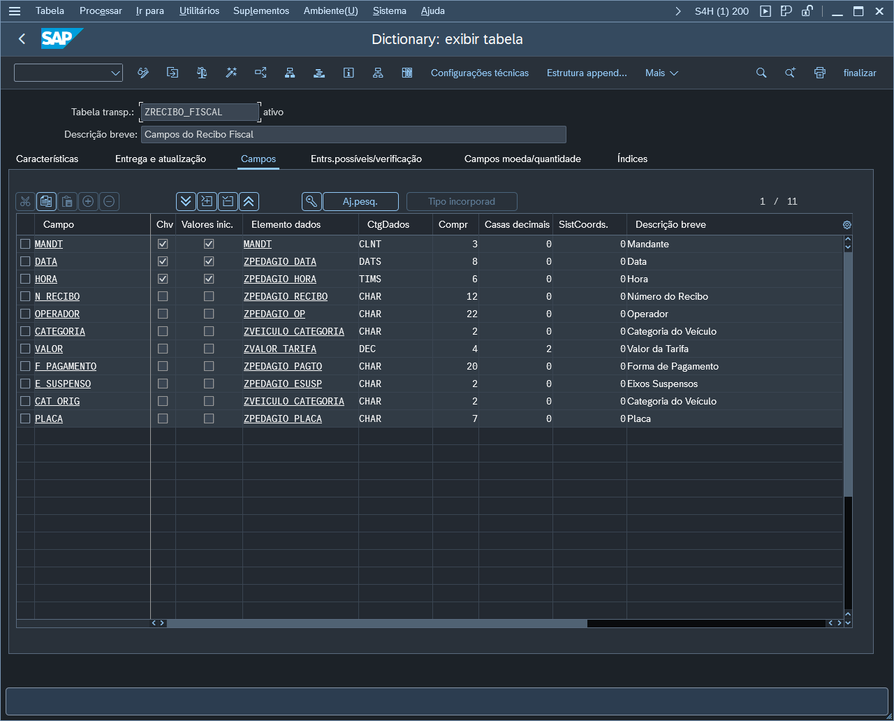
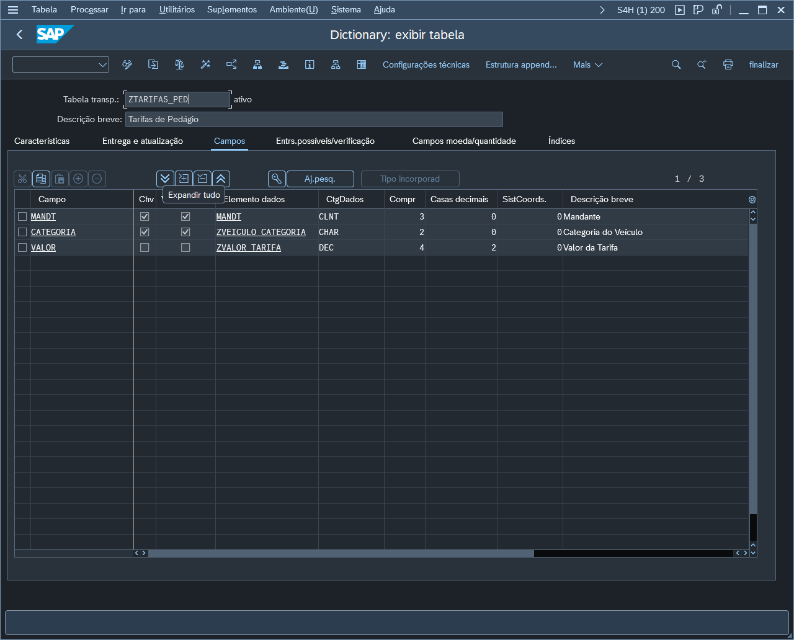
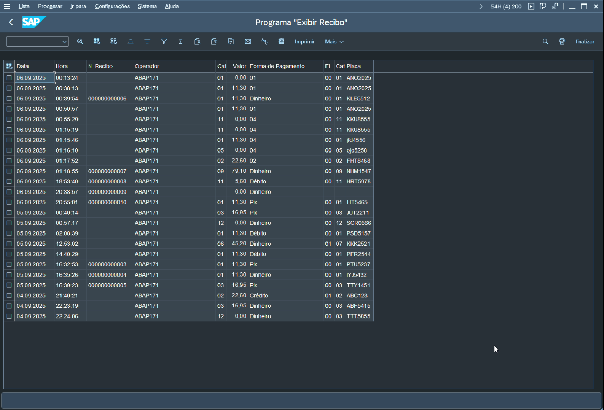

# Projeto SAP ABAP – Sistema de Gestão de Pedágio com Relatório ALV

Este projeto foi desenvolvido em ABAP como um sistema de controle de pedágio para registrar a passagem de veículos, gerar um recibo e criar um relatório ALV no SAP ERP com o histório de todos os veículos registrados.

## Funcionalidades

- Registro de passagens em pedágio, armazenando data, hora, categoria, placa, operador e forma de pagamento.
- Emissão de recibos fiscais e integração com tabela de tarifas de veículos.
- Consulta e exibição de dados em relatório **ALV interativo**.
- Estrutura modular, utilizando programas, includes e tabelas transparentes no SAP.

## Tecnologias

- SAP ERP
- ABAP
- Relatório ALV (ABAP List Viewer)
- Modularização de Código
- Tabelas transparentes no Data Dictionary

## Estrutura do Projeto

projeto-sap-abap-pedagio/  
├── src/  
│   ├── programas/  
│   │   ├── `ZEXIBE_RELATORIO.abap`  
│   │   └── `ZPRACA_PEDAGIO.abap`  
│   ├── includes/  
│   │   ├── `ZPRACA_PEDAGIO_F01.abap`  
│   │   └── `ZPRACA_PEDAGIO_S01.abap`  
│   ├── functions/  
│   │   └── `ZBUSCA_TARIFA.abap`  
├── screenshots/  
│   ├── `ZRECIBO_FISCAL.png`  
│   ├── `ZTARIFAS_PED.png`  
│   └── `RELATORIO_ALV.png`  
├── README.md  

## Estrutura das Tabelas

A estrutura das tabelas Z utilizadas pode ser vista abaixo:

### Tabela `ZRECIBO_FISCAL`

Registro de recibos emitidos.

### Tabela `ZTARIFAS_PED`

Armazena tarifas por categoria de veículo.

## Relatório ALV

Relatório customizado exibido em ALV para armazenar o histórico de cada veículo registrado:

## Instalação e Uso

1. Importar os objetos do projeto no **SAP Workbench (SE38, SE37, SE11, etc.)**.
2. Criar as tabelas `ZRECIBO_FISCAL` e `ZTARIFAS_PED` conforme a estrutura apresentada.
3. Ativar os programas principais e includes:
   - `ZPRACA_PEDAGIO` (programa principal de registro)
   - `ZEXIBE_RELATORIO` (relatório ALV)
4. Executar a transação associada ao programa `ZEXIBE_RELATORIO` para visualizar o relatório de recibos.
5. Inserir dados de teste na tabela de tarifas (`ZTARIFAS_PED`) para simular categorias de veículos e valores.

## Demonstração em Vídeo

Confira o funcionamento do sistema em execução:  
 🎥  [Assista no YouTube](https://youtu.be/sqR2cQ34pkw)

## Código-Fonte

Todo o código ABAP está na pasta `/src`, organizado por tipo:

- `/programas` – Programa principal de registro e relatório ALV
- `/includes` – Includes com lógicas auxiliares do programa principal
- `/functions` – Funções auxiliares 

## Autor

Desenvolvido por **Juliana Ferreira** como projeto pessoal de estudo e prática com ABAP.
  

###### *Este projeto foi desenvolvido com o objetivo de consolidar conhecimentos em ABAP, especialmente em modularização, tabelas transparentes e relatórios ALV*.

